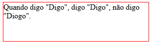

# Box Model
Todos os elementos HTML são tratados como caixas. O modelo de caixa se baseia em 4 elementos:

-   Área de conteúdo
-   Bordas
-   Área de preenchimento (padding)
-   Área de margem (margin)

Os elementos html podem ter todos os seus lados (top, right, bottom e left) configuráveis.

**Área do conteúdo e Bordas**

A área de borda ocorre da área de padding até a área que contém as bordas do elemento. O tamanho das bordas dos elementos influencia na área da borda.

A área do conteúdo é o espaço ocupado pelo conteúdo real do elemento. Neste caso, seria a área ocupada pelo texto que está dentro da div:

```HTML
 <div class="border">Quando digo "Digo", digo "Digo", não digo "Diogo".</div>
```

```CSS
.border {
    border: 1px solid red;
    height: 80px;
    width: 300px;
}
```



**Área de preenchimento (espaçamento interno)**

É a extensão do conteúdo. A configuração do padding determina o espaçamento interno do elemento (preenchimento) e também pode ser aplicado em qualquer lado do elemento.

Sem padding:


```HTML
<!DOCTYPE html>
<html>
    <head>
        <title>Box Model</title>

        <style>
            .square {
                height: 250px;
                width: 250px;
                background-color: cornflowerblue;
            }

            .circle {
                width: 250px;
                height: 250px;
                background-color: aqua;
                border-radius: 50%;
            }
        </style>
    </head>
    <body>
        <div class="square">
            <div class="circle"></div>
        </div>
    </body>
</html>

```

Com padding:


O elemento (círculo) do quadrado ficou colado a esquerda, pois o seu padding-left foi configurado como 0px, a mesma lógica se aplica nas demais configurações do padding:

```HTML
<!DOCTYPE html>
<html>
    <head>
        <title>Box Model</title>

        <style>
            .square {
                height: 250px;
                width: 250px;
                background-color: cornflowerblue;
                /* Uma das maneiras de configurar o padding*/
                padding-top: 50px;
                padding-right: 25px;
                padding-bottom: 15px;
                padding-left: 0px;
            }

            .circle {
                width: 250px;
                height: 250px;
                background-color: aqua;
                border-radius: 50%;
            }
        </style>
    </head>
    <body>
        <div class="square">
            <div class="circle"></div>
        </div>
    </body>
</html>
```

**Área de margem (espaçamento externo)**

Ocorre da área de borda até um espaço vazio da área externa ao elemento, que é o espaço que determina a distância entre o elemento em questão com os seus vizinhos. Em resumo, a configuração de margin determina o espaçamento externo ao redor do elemento. Também pode ser aplicado em qualquer lado do elemento.

Sem margin:


```HTML
<!DOCTYPE html>
<html>
    <head>
        <title>Box Model</title>

        <style>
            body {
                margin: 0px;
            }

            .square {
                height: 250px;
                width: 250px;
            }

            .first {
                background-color: aqua;
                float: left;
            }

            .second {
                background-color: aquamarine;
                float: left;
            }

            .third {
                background-color: cadetblue;
                clear: both;
            }
        </style>
    </head>
    <body>
        <div class="first square"></div>
        <div class="second square"></div>
        <div class="third square"></div>
    </body>
</html>

```

Com margin:


O primeiro quadrado abriu um espaçamento externo de 30px a partir da borda do seu topo, 30px a partir da sua borda lateral direita, 15px da sua borda inferior e 37px da sua borda esquerda.

```HTML
<!DOCTYPE html>
<html>
    <head>
        <title>Box Model</title>

        <style>
            body {
                margin: 0px;
            }

            .square {
                height: 250px;
                width: 250px;
            }

            .first {
                background-color: aqua;
                float: left;
                /* Top, right, bottom, left -> Uma outra maneira de configurar tanto a margin quanto o padding */
                margin: 30px 30px 15px 37px;
            }

            .second {
                background-color: aquamarine;
                float: left;
            }

            .third {
                background-color: cadetblue;
                clear: both;
            }
        </style>
    </head>
    <body>
        <div class="first square"></div>
        <div class="second square"></div>
        <div class="third square"></div>
    </body>
</html>
```

## Referências

-   https://developer.mozilla.org/pt-BR/docs/Web/CSS/box_model
-   https://www.w3schools.com/css/css_padding.asp
-   https://www.w3schools.com/css/css_margin.asp
