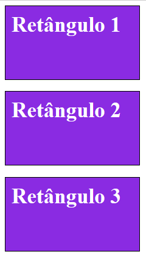
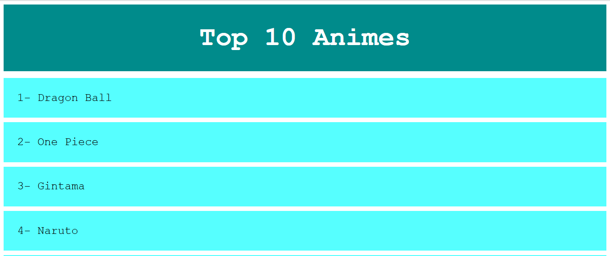

# Classes e IDs

## Class

Class é um atributo html, utilizado para referênciar o nome de uma classe CSS. Ela é criada com a sintaxe .nomeClasse { configuração css }

A mesma classe pode ser atribuída a um ou mais elementos html:

```HTML
<!DOCTYPE html>
<html lang="en">
    <head>
        <meta charset="UTF-8" />
        <title>Classes IDs</title>

        <style>
            .rectangle {
                width: 200px;
                height: 100px;
                border: 1px solid black;
                background-color: blueviolet;
                font-size: 35px;
                font-weight: bold;
                color: #fff;
                padding: 10px;
            }
        </style>
    </head>
    <!--Os três elementos que possuem o atributo class = "rectangle" recebem as configurações css definidas na classe rectangle -->
    <body>
        <div class="rectangle">Retângulo 1</div>
        <br />
        <div class="rectangle">Retângulo 2</div>
        <br />
        <div class="rectangle">Retângulo 3</div>
    </body>
</html>
```



## ID

Diferente das classes, estes devem ser únicos na página, ou seja, não deve haver mais de um elemento html utilizando o mesmo id na página. A sua sintaxe é #nomeID {
propriedades css
}

```HTML
<!DOCTYPE html>
<html lang="en">
    <head>
        <meta charset="UTF-8" />
        <title>Classes IDs</title>

        <style>
            body {
                font-family: 'Courier New', Courier, monospace;
            }
            #main {
                background-color: darkcyan;
                text-align: center;
                padding: 40px;
                font-size: 60px;
                color: #fff;
                font-weight: bold;
                margin-bottom: 15px;
            }

            .anime {
                background-color: rgba(0, 255, 255, 0.664);
                padding: 30px;
                margin-bottom: 10px;
                font-size: 25px;
                color: #000;
            }
        </style>
    </head>
    <body>
        <div id="main">Top 10 Animes</div>
        <div class="anime">1- Dragon Ball</div>
        <div class="anime">2- One Piece</div>
        <div class="anime">3- Gintama</div>
        <div class="anime">4- Naruto</div>
        <div class="anime">5- Inuyasha</div>
        <div class="anime">6- Shaman King</div>
        <div class="anime">7- Hunter x Hunter</div>
        <div class="anime">8- My Hero Academia</div>
        <div class="anime">9- Attack on Titan</div>
        <div class="anime">10- Nanatsu no Taizai</div>
    </body>
</html>
```



## Referências

-   https://www.w3schools.com/html/html_classes.asp
-   https://www.w3schools.com/html/html_id.asp
