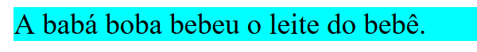
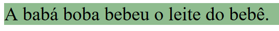
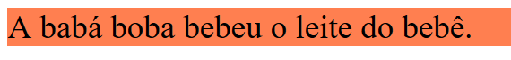
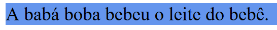
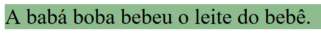

# Especificidade

É a ordem que o navegador vai aplicar um determinado seletor dentro da página.

Algumas assertivas:

    1- O !important passa por cima das outras especificidades, o seu uso é desencorajado.

    2- Alguns seletores são mais específicos que os outros.

    3- Em termo de empate, a última regra processada se torna a mais específica.

Dada a estrutura:

```HTML
<!DOCTYPE html>
<html>
    <head>
        <meta charset="UTF-8" />
        <title>Especificidade CSS</title>
    </head>

    <body>
        <p class="travaLingua">A babá boba bebeu o leite do bebê.</p>
    </body>
</html>
```

Ao aplicar a configuração no seletor parágrafo:

```CSS
   p {
        background-color: aqua;
    }
```



E depois aplicar a mesma configuração na classe:

```CSS
.travaLingua {
    background-color: darkseagreen;
}
```



Percebe-se que a configuração do seletor p foi sobrescrito pela configuração da classe, pois a classe é um seletor mais específico que p.

Se selecionado uma classe associada com um parágrafo:

```CSS
 p.travaLingua {
    background-color: coral;
 }
```

Após aplicar a configuração, resulta em:


Pois o seletor anterior seletor é o mais específico dos três.

Se aplicado dois seletores com a mesma prioridade de especificidade (empate), o último seletor processado é aplicado:

```CSS
 p.travaLingua {
        background-color: coral;
 }

p.travaLingua {
        background-color: cornflowerblue;
}
```



Utilizando o !important:

```CSS
 .travaLingua {
    background-color: darkseagreen !important;
 }
```



Isso ocorre porque o !important sobreescreve as demais especificidades, então a configuração da classe é aplicada, mesmo que ela seja menos específica que uma classe associada com um parágrafo..

## Referências

https://developer.mozilla.org/pt-BR/docs/Web/CSS/Specificity
