# Flexbox

O flexbox é uma tecnologia que facilita a criação de layouts complexos e flexíveis. É unidimensional, ou seja, trabalha seus layouts em uma única direção, vertical ou horizontal (o elemento flex é iniciado na direção horizontal). Essa tecnologia consegue resolver problemas de layout que o float e o position não conseguem lidar.

O flexbox possibilita:

-   Centralizar um bloco de conteúdo verticalmente dentro do seu contâiner pai.

-   Fazer com que os filhos de um container ocupe uma quantidade igual de largura/altura, mesmo que contenham uma quantidade diferente de conteúdo.

-   Fazer todas as colunas de um layout com múltiplas colunas adotarem a mesma altura, mesmo que contenham uma quantidade diferente de conteúdo.

## Flex Container

As suas configurações ditam como o container pai organiza os seus filhos.

Para dizer que um elemento é o container flex, aplica-se a configuração _display:flex;_

```HTML
<html>
    <head>
        <meta charset="UTF-8" />
        <title>Flexbox parte 1</title>

        <style>
            div {
                border: solid 5px dodgerblue;
                font-size: 40px;
                margin: 5px;
            }

            .big {
                font-size: 1.5em;
            }

            .flex-container {
                display: flex;
            }
        </style>
    </head>

    <body>
        <div class="flex-container">
            <div>1</div>
            <div>2</div>
            <div class="big">3</div>
            <div>4</div>
            <div>5</div>
            <div>6</div>
            <div>7</div>
            <div>8</div>
            <div>9</div>
            <div>10</div>
        </div>
    </body>
</html>
```

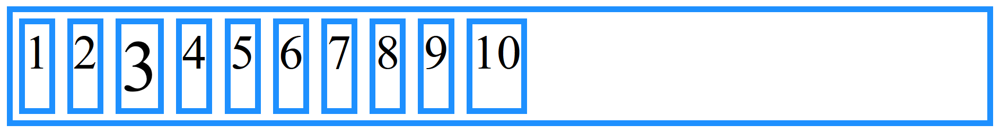

**flex-direction**

Define a direção dos _flex items_. Por padrão, é iniciado como row (linha).

-   flex-direction: column;

```CSS
 .flex-container {
        display: flex;

        /* Os itens ficam em uma única coluna, um abaixo do outro */
        flex-direction: column;
}
```

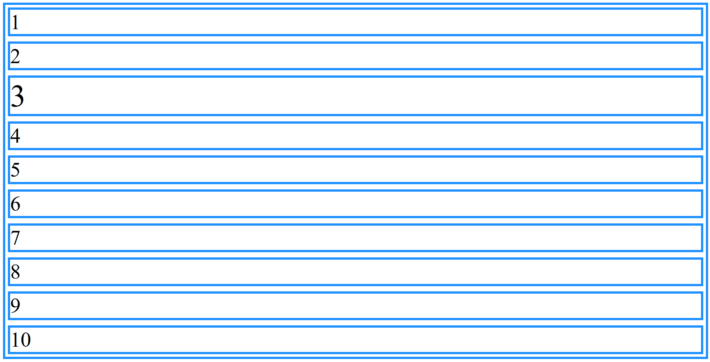

-   flex-direction: column-reverse;

```CSS
 .flex-container {
        display: flex;

        flex-direction: column;
        /* Os itens continuam em coluna, igualmente o exemplo anterior, porém a ordem dos itens é invertida */
        flex-direction: column-reverse;
}
```

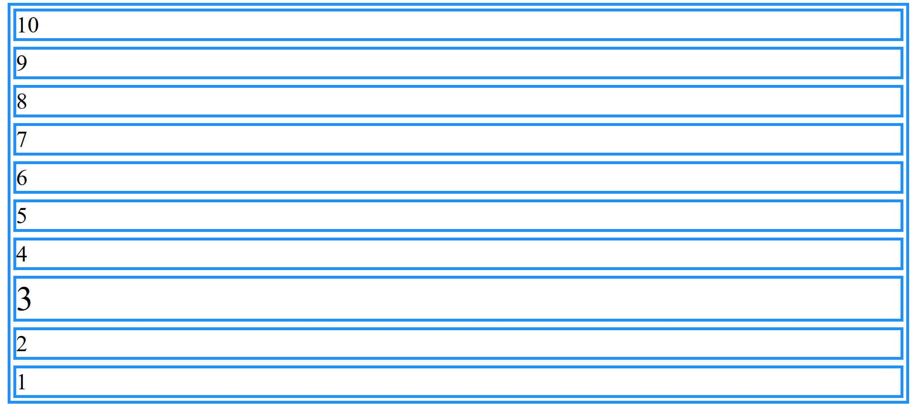

-   flex-direction: row;

```CSS
 .flex-container {
        display: flex;

        flex-direction: column;
        flex-direction: column-reverse;

        /* Os flex items ficam em linha */
        flex-direction: row;
}
```

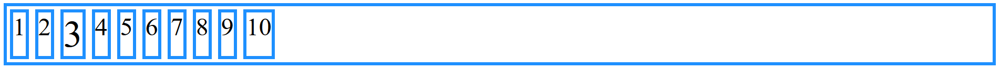

-   flex-direction: row-reverse;

```CSS
 .flex-container {
        display: flex;

        flex-direction: column;
        flex-direction: column-reverse;
        flex-direction: row;

        /* Os elementos ficam em linha, mas a sua ordem é invertida */
        flex-direction: row-reverse;
}
```

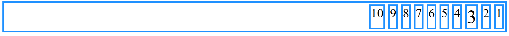

**flex-wrap**

Define se os itens devem quebrar ou não a linha.

Configurando uma nova largura para possibilitar outros comportamentos:

```CSS
 .flex-container {
        display: flex;

        flex-direction: column;
        flex-direction: column-reverse;
        flex-direction: row;
        flex-direction: row-reverse;

        /* A idéia é diminuir o container para forçar a saída de um dos flex items */
        width: 23%;
}
```

Nesse cenário, os elementos vão além do limite do container, para resolver isso, basta utilizar o flex-wrap.

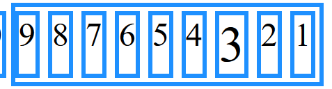

-   flex-wrap: wrap;

```CSS
 .flex-container {
        display: flex;

        flex-direction: column;
        flex-direction: column-reverse;
        flex-direction: row;
        flex-direction: row-reverse;

        width: 23%;
        /* Quebra em linha os itens do container flex */
        flex-wrap: wrap;
}
```


-   flex-wrap: wrap-reverse ;

```CSS
 .flex-container {

        display: flex;

        flex-direction: column;
        flex-direction: column-reverse;
        flex-direction: row;
        flex-direction: row-reverse;

        width: 23%;
        flex-wrap: wrap;
        /* Assim como no exemplo anterior, a linha é quebrada quando um dos flex items ultrapassa o limite do seu container, só que, nesse caso, a ordem de quebra é invertida */
        flex-wrap: wrap-reverse;
}
```

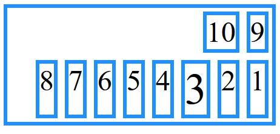

**flex-flow**

É uma "mistura" do flex-wrap com o flex-direction.

-   flex-flow: row wrap;

```CSS
 .flex-container {
        display: flex;

        flex-direction: column;
        flex-direction: column-reverse;
        flex-direction: row;
        flex-direction: row-reverse;

        width: 23%;
        flex-wrap: wrap;
        flex-wrap: wrap-reverse;
        /* Coloca os conteúdos em linha e realiza a quebra */
        flex-flow: row wrap;
}
```


Configurando a altura para observar novos comportamentos:

```CSS
 .flex-container {
        display: flex;

        flex-direction: column;
        flex-direction: column-reverse;
        flex-direction: row;
        flex-direction: row-reverse;

        width: 23%;
        flex-wrap: wrap;
        flex-wrap: wrap-reverse;
        flex-flow: row wrap;

        height: 200px;
}
```

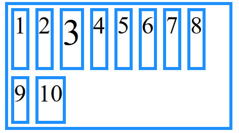

-   flex-flow: column-reverse wrap;

```CSS
 .flex-container {
        display: flex;

        flex-direction: column;
        flex-direction: column-reverse;
        flex-direction: row;
        flex-direction: row-reverse;

        width: 23%;
        flex-wrap: wrap;
        flex-wrap: wrap-reverse;
        flex-flow: row wrap;

        height: 200px;
        /* Quebra em colunas com os elementos na ordem invertida*/
        flex-flow: column-reverse wrap;
}
```

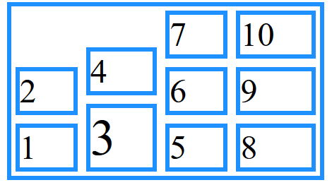

Voltando para o estado de flex-flow: row wrap;

```CSS
 .flex-container {
        display: flex;

        flex-direction: column;
        flex-direction: column-reverse;
        flex-direction: row;
        flex-direction: row-reverse;

        width: 23%;
        flex-wrap: wrap;
        flex-wrap: wrap-reverse;
        flex-flow: row wrap;

        height: 200px;
        /* Quebra em colunas com os elementos na ordem invertida*/
        flex-flow: column-reverse wrap;
        flex-flow: row wrap;
}
```

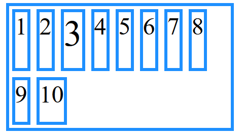

**justify-content**

Alinha os itens de acordo com a direção. A propriedade só funciona se os _flex items_ não ocuparem todo o container.

-   justify-content: flex-start;

```CSS
 .flex-container {
        display: flex;

        flex-direction: column;
        flex-direction: column-reverse;
        flex-direction: row;
        flex-direction: row-reverse;

        width: 23%;
        flex-wrap: wrap;
        flex-wrap: wrap-reverse;
        flex-flow: row wrap;

        height: 200px;

        flex-flow: column-reverse wrap;
        flex-flow: row wrap;
        /* Alinha os itens a partir do início do container */
        justify-content: flex-start;
}
```

Nesse caso, não houve a necessidade de alteração, pois os itens já estavam de início alinhados da esquerda para direita.

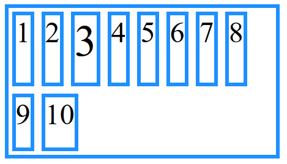

-   justify-content: flex-start;

```CSS
 .flex-container {
        display: flex;

        flex-direction: column;
        flex-direction: column-reverse;
        flex-direction: row;
        flex-direction: row-reverse;

        width: 23%;
        flex-wrap: wrap;
        flex-wrap: wrap-reverse;
        flex-flow: row wrap;

        height: 200px;

        flex-flow: column-reverse wrap;
        flex-flow: row wrap;

        justify-content: flex-start;
        /* Alinha os itens da direita (fim) para esquerda (início) */
        justify-content: flex-end;
}
```

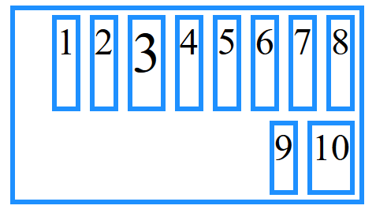

-   justify-content: center;

```CSS
 .flex-container {
        display: flex;

        flex-direction: column;
        flex-direction: column-reverse;
        flex-direction: row;
        flex-direction: row-reverse;

        width: 23%;
        flex-wrap: wrap;
        flex-wrap: wrap-reverse;
        flex-flow: row wrap;

        height: 200px;

        flex-flow: column-reverse wrap;
        flex-flow: row wrap;

        justify-content: flex-start;
        justify-content: flex-end;
        /* Alinha os itens ao centro */
        justify-content: center;
}
```

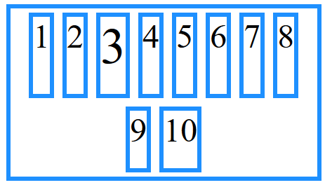

-   justify-content: space-around;

```CSS
.flex-container {
        display: flex;

        flex-direction: column;
        flex-direction: column-reverse;
        flex-direction: row;
        flex-direction: row-reverse;

        width: 23%;
        flex-wrap: wrap;
        flex-wrap: wrap-reverse;
        flex-flow: row wrap;

        height: 200px;

        flex-flow: column-reverse wrap;
        flex-flow: row wrap;

        justify-content: flex-start;
        justify-content: flex-end;
        justify-content: center;
        /* Cola o primeiro item no início do container e o último no final, calculando e aplicando um espaçamento igual entre os itens */
        justify-content: space-around;
}
```

Na segunda linha, o 9 foi alocado no início e o 10 alocado no final. Como não há nenhum elemento entre eles, o espaçamento do meio fica com o dobro do tamanho do espaçamento a esquerda do 9 e a direita do 10.


**align-items**

Alinha os itens de acordo com o eixo do container. O alinhamento é diferente para quando os itens estão em colunas ou em linhas.

A altura do container foi modificada mais uma vez:

```CSS
.flex-container {
        display: flex;

        flex-direction: column;
        flex-direction: column-reverse;
        flex-direction: row;
        flex-direction: row-reverse;

        width: 23%;
        flex-wrap: wrap;
        flex-wrap: wrap-reverse;
        flex-flow: row wrap;

        height: 200px;

        flex-flow: column-reverse wrap;
        flex-flow: row wrap;

        justify-content: flex-start;
        justify-content: flex-end;
        justify-content: center;
        justify-content: space-around;

        height: 400px;
}
```

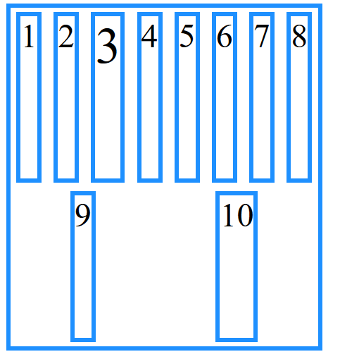

-   align-items: baseline;

```CSS
.flex-container {
        display: flex;

        flex-direction: column;
        flex-direction: column-reverse;
        flex-direction: row;
        flex-direction: row-reverse;

        width: 23%;
        flex-wrap: wrap;
        flex-wrap: wrap-reverse;
        flex-flow: row wrap;

        height: 200px;

        flex-flow: column-reverse wrap;
        flex-flow: row wrap;

        justify-content: flex-start;
        justify-content: flex-end;
        justify-content: center;
        justify-content: space-around;

        height: 400px;
        /* Alinha os itens de acordo com a linha base da tipografia */
        align-items: baseline;
}
```

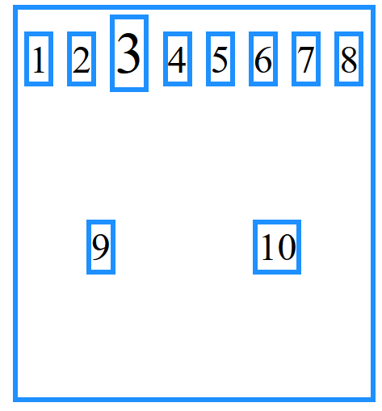

-   align-items: flex-start;

```CSS
.flex-container {
        display: flex;

        flex-direction: column;
        flex-direction: column-reverse;
        flex-direction: row;
        flex-direction: row-reverse;

        width: 23%;
        flex-wrap: wrap;
        flex-wrap: wrap-reverse;
        flex-flow: row wrap;

        height: 200px;

        flex-flow: column-reverse wrap;
        flex-flow: row wrap;

        justify-content: flex-start;
        justify-content: flex-end;
        justify-content: center;
        justify-content: space-around;

        height: 400px;
        align-items: baseline;
        /* Alinha os itens ao início */
        align-items: flex-start;
}
```

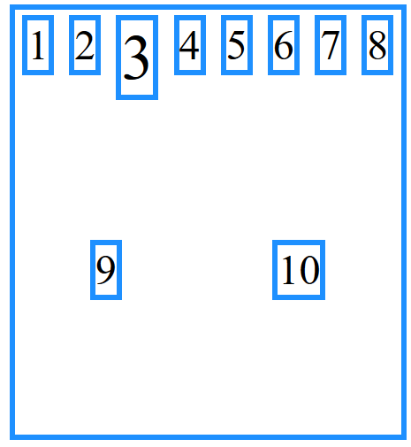

-   align-items: flex-end;

```CSS
.flex-container {
        display: flex;

        flex-direction: column;
        flex-direction: column-reverse;
        flex-direction: row;
        flex-direction: row-reverse;

        width: 23%;
        flex-wrap: wrap;
        flex-wrap: wrap-reverse;
        flex-flow: row wrap;

        height: 200px;

        flex-flow: column-reverse wrap;
        flex-flow: row wrap;

        justify-content: flex-start;
        justify-content: flex-end;
        justify-content: center;
        justify-content: space-around;

        height: 400px;
        align-items: baseline;
        align-items: flex-start;
        /* Alinha os itens ao final */
        align-items: flex-end;
}
```

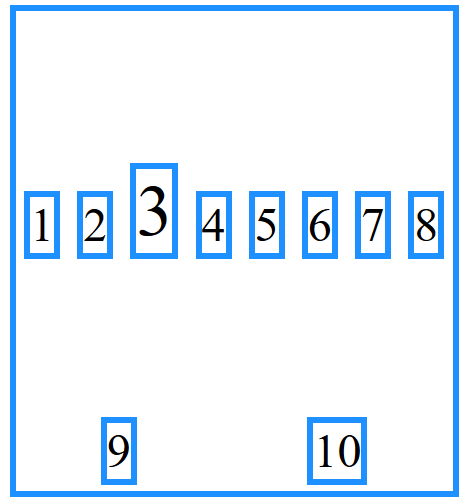

```CSS
.flex-container {
        display: flex;

        flex-direction: column;
        flex-direction: column-reverse;
        flex-direction: row;
        flex-direction: row-reverse;

        width: 23%;
        flex-wrap: wrap;
        flex-wrap: wrap-reverse;
        flex-flow: row wrap;

        height: 200px;

        flex-flow: column-reverse wrap;
        flex-flow: row wrap;

        justify-content: flex-start;
        justify-content: flex-end;
        justify-content: center;
        justify-content: space-around;

        height: 400px;
        align-items: baseline;
        align-items: flex-start;
        align-items: flex-end;
        /* Alinha os itens ao centro */
        align-items: center;
}
```

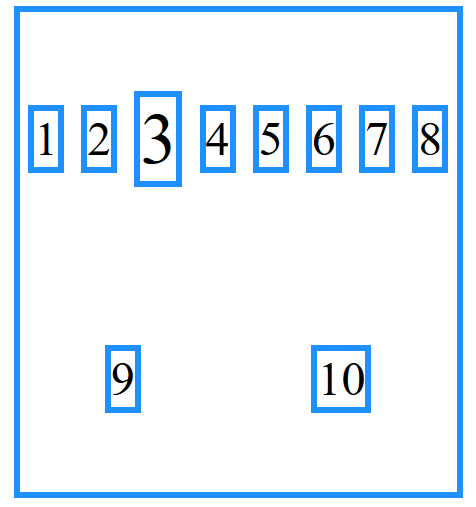

**align-content**

Alinha as linhas do container de acordo com o eixo vertical. Para a propriedade ser aplicada é necessário que exista mais de uma linha de flex itens.

-   align-content: flex-start;

```CSS
.flex-container {
        display: flex;

        flex-direction: column;
        flex-direction: column-reverse;
        flex-direction: row;
        flex-direction: row-reverse;

        width: 23%;
        flex-wrap: wrap;
        flex-wrap: wrap-reverse;
        flex-flow: row wrap;

        height: 200px;

        flex-flow: column-reverse wrap;
        flex-flow: row wrap;

        justify-content: flex-start;
        justify-content: flex-end;
        justify-content: center;
        justify-content: space-around;

        height: 400px;
        align-items: baseline;
        align-items: flex-start;
        align-items: flex-end;
        align-items: center;

        /* Alinha todas as linhas de itens ao início do container */
        align-content: flex-start;
}
```

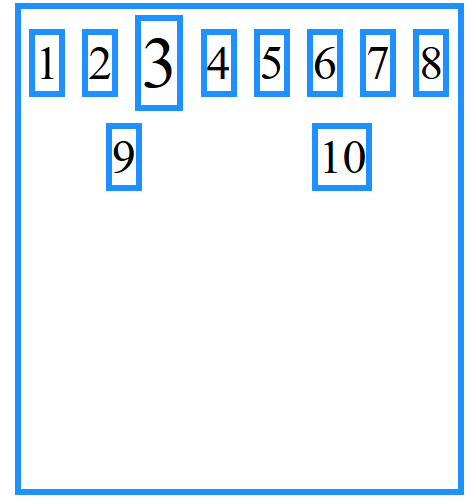

-   align-content: flex-end;

```CSS
.flex-container {
        display: flex;

        flex-direction: column;
        flex-direction: column-reverse;
        flex-direction: row;
        flex-direction: row-reverse;

        width: 23%;
        flex-wrap: wrap;
        flex-wrap: wrap-reverse;
        flex-flow: row wrap;

        height: 200px;

        flex-flow: column-reverse wrap;
        flex-flow: row wrap;

        justify-content: flex-start;
        justify-content: flex-end;
        justify-content: center;
        justify-content: space-around;

        height: 400px;
        align-items: baseline;
        align-items: flex-start;
        align-items: flex-end;
        align-items: center;

        align-content: flex-start;
        /* Alinha todas as linhas de itens ao final do container */
        align-content: flex-end;
}
```

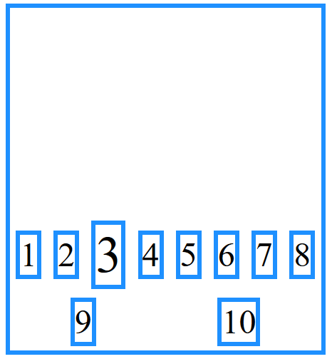

-   align-content: space-around;

```CSS
.flex-container {
        display: flex;

        flex-direction: column;
        flex-direction: column-reverse;
        flex-direction: row;
        flex-direction: row-reverse;

        width: 23%;
        flex-wrap: wrap;
        flex-wrap: wrap-reverse;
        flex-flow: row wrap;

        height: 200px;

        flex-flow: column-reverse wrap;
        flex-flow: row wrap;

        justify-content: flex-start;
        justify-content: flex-end;
        justify-content: center;
        justify-content: space-around;

        height: 400px;
        align-items: baseline;
        align-items: flex-start;
        align-items: flex-end;
        align-items: center;

        align-content: flex-start;
        align-content: flex-end;
        /* Cria um espaçamento entre as linhas, onde os espaçamentos do meio são duas vezes maiores que o top e bottom */
        align-content: space-around;
}
```


-   align-content: space-between;

```CSS
.flex-container {
        display: flex;

        flex-direction: column;
        flex-direction: column-reverse;
        flex-direction: row;
        flex-direction: row-reverse;

        width: 23%;
        flex-wrap: wrap;
        flex-wrap: wrap-reverse;
        flex-flow: row wrap;

        height: 200px;

        flex-flow: column-reverse wrap;
        flex-flow: row wrap;

        justify-content: flex-start;
        justify-content: flex-end;
        justify-content: center;
        justify-content: space-around;

        height: 400px;
        align-items: baseline;
        align-items: flex-start;
        align-items: flex-end;
        align-items: center;

        align-content: flex-start;
        align-content: flex-end;
        align-content: space-around;
         /* Cria um espaçamento igual entre as linhas, onde a primeira fica grudada no topo e a última no bottom */
        align-content: space-between;
}
```

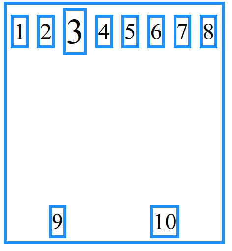

## Referências

-   https://developer.mozilla.org/pt-BR/docs/Learn/CSS/CSS_layout/Flexbox

-   https://origamid.com/projetos/flexbox-guia-completo/

-   https://www.w3schools.com/css/css3_flexbox.asp
