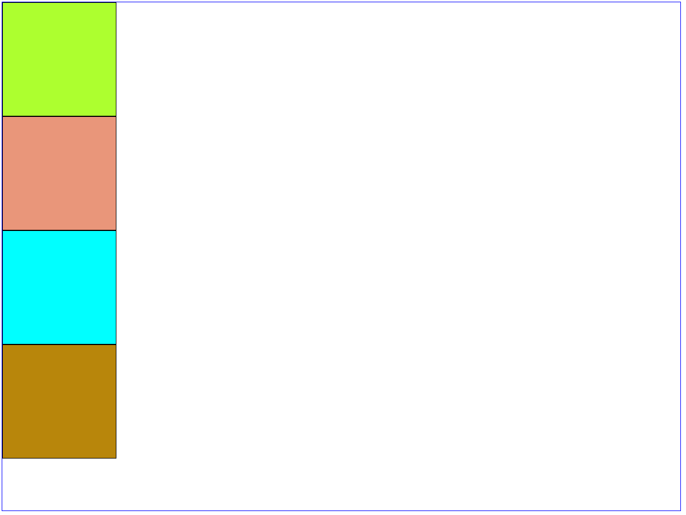
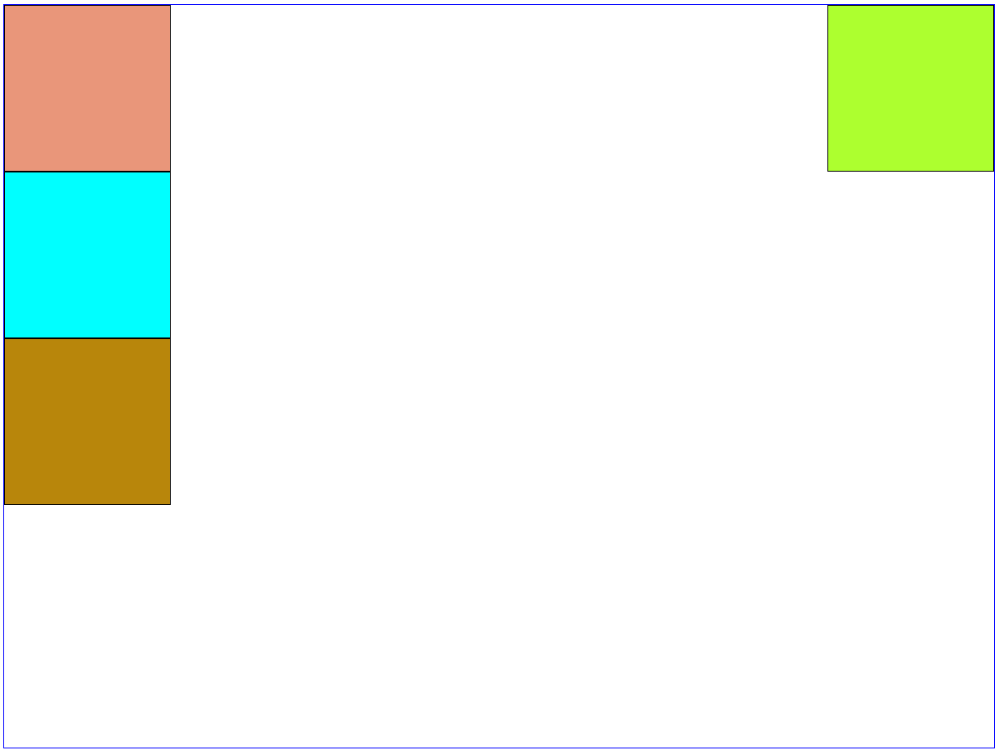
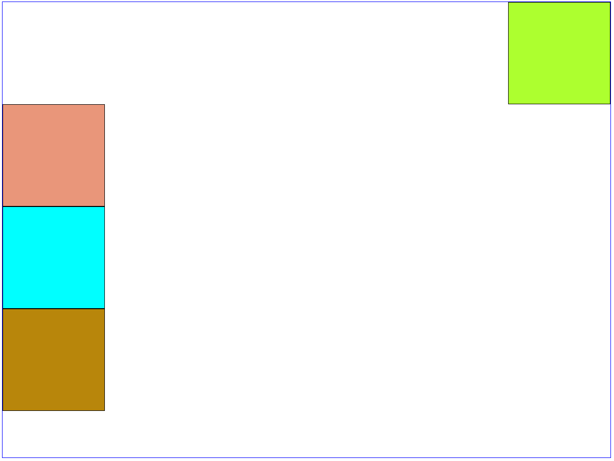
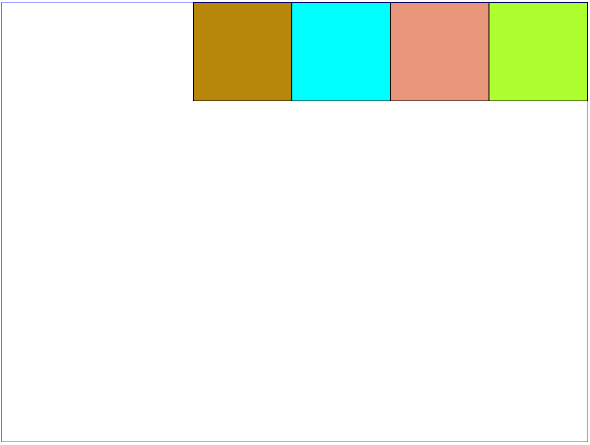

# Float

É uma propriedade CSS que retira um elemento do seu fluxo normal e coloca-o no lado esquerdo ou direito do seu container.

Dada a estrutura:



```HTML
<!DOCTYPE html>
<html>
    <head>
        <title>Float</title>

        <style>
            .square {
                height: 200px;
                width: 200px;
                border: 1px solid black;
            }

            .container {
                width: 1200px;
                height: 900px;
                border: 1px solid blue;
            }

            .c1 {
                background-color: greenyellow;
            }

            .c2 {
                background-color: darksalmon;
            }

            .c3 {
                background-color: aqua;
            }

            .c4 {
                background-color: darkgoldenrod;
            }
        </style>
    </head>
    <body>
        <div class="container">
            <div class="square c1"></div>
            <div class="square c2"></div>
            <div class="square c3"></div>
            <div class="square c4"></div>
        </div>
    </body>
</html>
```

Ao colocar o _float:right_ no primeiro elemento, ele passa a flutuar a direita dentro do seu container:



```CSS
.c1 {
    background-color: greenyellow;
    float: right;
}
```

Porém, o c2 começa a ocupar a mesma linha do c1, isso ocorre porque os demais elementos passam a ignorar o fluxo do elemento configurado com a propriedade float.

Essa situação pode ser contornada utilizando a propriedade _clear_ em c2:



```CSS
.c2 {
    background-color: darksalmon;
    clear: right;
}
```

O clear pode ser utilizado tanto para o _float:left_ quanto para o _float:right_, ou até para ambos: _clear:both_

Ao aplicar o _float:left_ em todos os elementos, o resultado é este:


```CSS
   .square {
           height: 200px;
           width: 200px;
           border: 1px solid black;
           float: left;
   }
```

O c1 configurado com o _float:left_, foi para a sua devida posição (lado esquerdo do seu container), o c2 configurado com o _float:left_ também foi para a sua devida posição, porém o c1 já estava ocupando este espaço, então o c2 encostou nele, a mesma regra é aplicada para os demais itens do container.

Se todos fossem invertidos para o _float:right_, ficaria assim:



```CSS
.square {
        height: 200px;
        width: 200px;
        border: 1px solid black;
        float: right;
}
```

## Referências

-   https://developer.mozilla.org/pt-BR/docs/Web/CSS/float
-   https://www.w3schools.com/cssref/pr_class_float.asp
