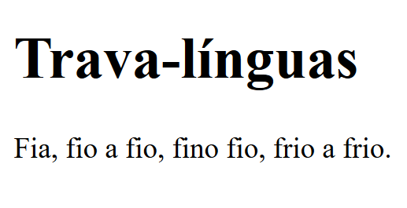

# Herança

Está relacionado com a transmissão dos atributos de um elemento pai para seu elemento filho. Existem propriedades que podem ser herdadas e outras que não podem.

Exemplo 1:

Os elementos iniciam no seu formato padrão

```HTML
<html>
    <head>
        <meta charset="UTF-8" />
        <title>Herança CSS</title>

        <style></style>
    </head>

    <body>
        <h1>Trava-línguas</h1>
        <p>Fia, fio a fio, fino fio, frio a frio.</p>
    </body>
</html>
```



Porém, ao configurar a tag body, os elementos recebem por herança a sua configuração, perceba que a border não foi passada para o h1 e nem para o p, isso acontece porque algumas propriedades, como dito acima, não são passadas por herança:

```HTML
<html>
    <head>
        <meta charset="UTF-8" />
        <title>Herança CSS</title>

        <style>
            body {
                font-family: Verdana, Geneva, Tahoma, sans-serif;
                color:darkcyan;
                border: 3px solid black;
            }
        </style>
    </head>

    <body>
        <h1>Trava-línguas</h1>
        <p>Fia, fio a fio, fino fio, frio a frio.</p>
    </body>
</html>
```


**inherit** é uma palavra-chave que permite especificar explicitamente a herança.

Dentro da tag style, logo abaixo da configuração do seletor body, se adicionarmos o código abaixo, definindo explicitamente que h1 receberá por herança as configurações da sua tag pai (body), a configuração border que não foi aplicada anteriormente, será passada para h1:

```CSS
h1 {
    border: inherit;
}
```


## Referências

-   https://developer.mozilla.org/pt-BR/docs/Web/CSS/inheritance
