# Seletores

Selecionam elementos do DOM e aplicam as devidas estilizações css escritas no corpo do seletor.

Dada a estrutura:

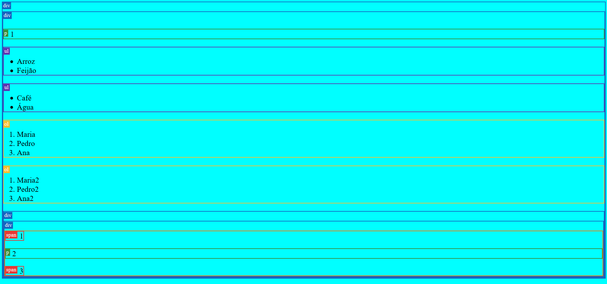

```HTML
<body>
        <div class="tag">
            <div class="tag">
                <p class="tag">1</p>
                <ul class="tag" feira="casa">
                    <li>Arroz</li>
                    <li>Feijão</li>
                </ul>
                <ul class="tag" feira="escritorio empresa">
                    <li>Café</li>
                    <li>Água</li>
                </ul>
                <ol id="aprovados" class="tag">
                    <li>Maria</li>
                    <li>Pedro</li>
                    <li>Ana</li>
                </ol>
                <ol id="aprovados" class="tag">
                    <li>Maria2</li>
                    <li>Pedro2</li>
                    <li>Ana2</li>
                </ol>
                <div id="aninhado" class="tag">
                    <div class="tag">
                        <section class="tag nolabel">
                            <span class="tag">1</span>
                            <p class="tag">2</p>
                            <span class="tag">3</span>
                        </section>
                    </div>
                </div>
            </div>
        </div>

          <script>
            const colors = {
                p: '#388e3c',
                div: '#1565c0',
                span: '#e53935',
                section: '#f67809',
                ul: '#5e35b1',
                ol: '#fbc02d',
                header: '#d81b60',
                nav: '#64dd17',
                main: '#00acc1',
                footer: '#304ffe',
                form: '#9f6581',
                body: '#25b6da',
                padrao: '#616161',
                get(tag) {
                    return this[tag] ? this[tag] : this.padrao;
                },
            };

            document.querySelectorAll('.tag').forEach((elemento) => {
                const tagName = elemento.tagName.toLowerCase();

                elemento.style.borderColor = colors.get(tagName);

                if (!elemento.classList.contains('nolabel')) {
                    const label = document.createElement('label');

                    label.style.backgroundColor = colors.get(tagName);
                    label.innerHTML = tagName;
                    elemento.insertBefore(label, elemento.childNodes[0]);
                }
            });
        </script>
    </body>
```

Podemos testar alguns seletores, são eles:

**Universal**

Seleciona e configura todos os elementos do documento:

```CSS
* {
  color: #ff0;
  background-color: #f77;
}
```

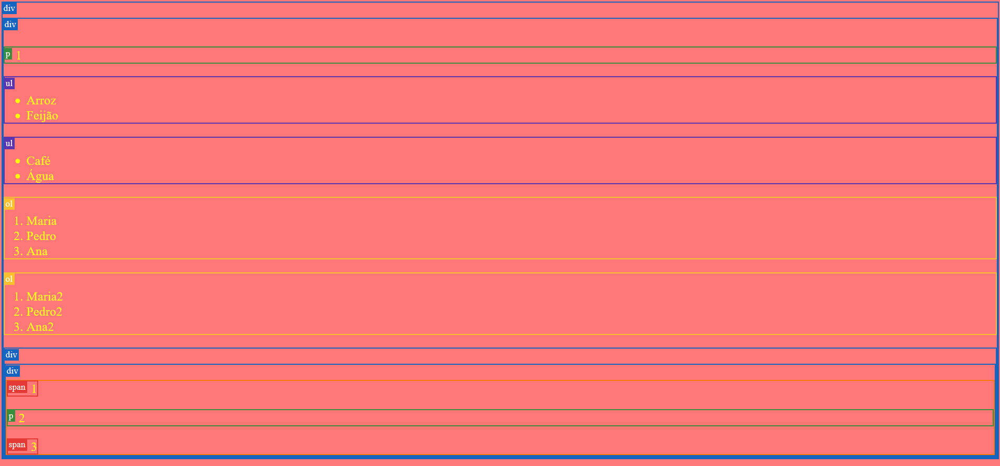

**De classe**

Seleciona e configura todos os elementos que possuem a classe "tag":

```CSS
.tag {
    color: #ff0;
    background-color: #f77;
}
```

Lembrando que o body é o único elemento que não está marcado com a classe "tag", por isso o fundo continuou azul claro, os demais elementos receberam a estilização.

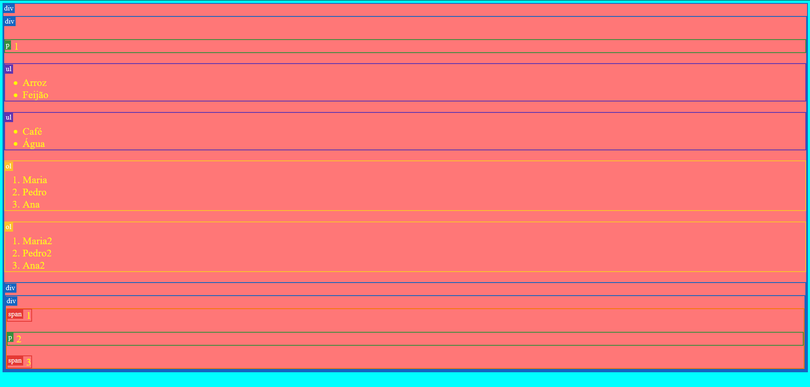

**De ID**

Seleciona e configura todos os elementos com o ID "aprovados":

```CSS
#aprovados {
    color: #ff0;
    background-color: #f77;
}
```

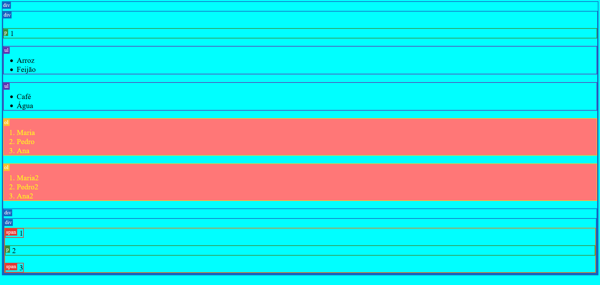

**Descendente direto (A > E)**

Seleciona qualquer elemento E que seja descendente direto de um elemento A:

```CSS
#aninhado > div {
    color: #ff0;
    background-color: #f77;
}
```

Pega o elemento marcado com o ID aninhado e seleciona a primeira DIV:

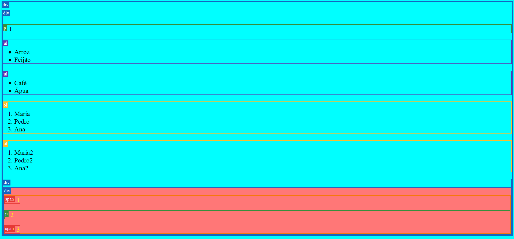

**Descendente (A E)**

Seleciona qualquer elemento E que seja descendente de A .

```CSS
#aninhado span {
    color: #ff0;
    background-color: #f77;
}
```

Os elementos span que são descendente de #aninhado foram selecionado.

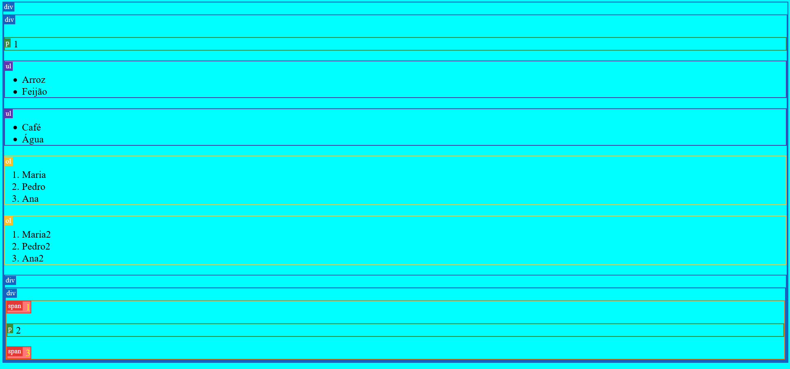

**Irmãos adjacentes (A + E)**

Seleciona o elemento E que é adjacente ao elemento A, ou seja, pega o próximo filho do mesmo parente.

```CSS
p + ul {
    color: #ff0;
    background-color: #f77;
}
```

Pega o elemento ul que vem depois de uma tag p.

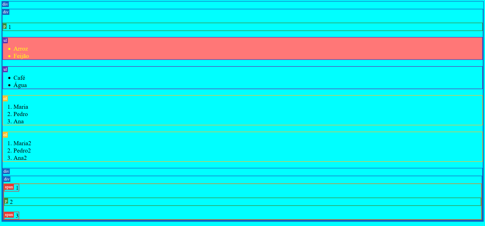

**Irmãos gerais (A ~ B)**

Seleciona o elemento B que tem algum elemento A como irmão.

```CSS
p ~ ol {
    color: #ff0;
    background-color: #f77;
}
```

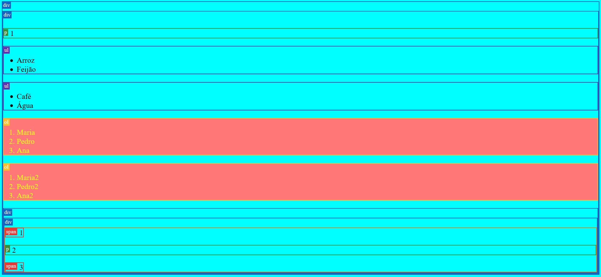

**Seletor de atributo []**

Seleciona todos os elementos que tiverem o atributo que está nos [].

```CSS
[feira] {
    color: #ff0;
    background-color: #f77;
}
```

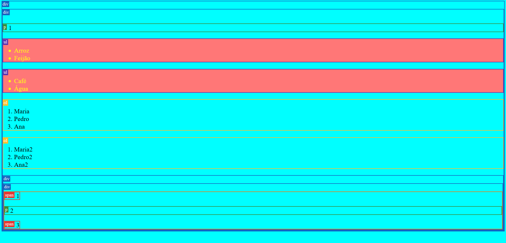

Seleciona o elemento que tem o atributo feira com as letras pr no nome do seu valor:

```CSS
[feira *= pr] {
    color: #ff0;
    background-color: #f77;
}
```

O elemento selecionado possui o atributo feira que tem o valor de "empresa", este valor possui as letras "pr" que são os parâmetros de busca no exemplo acima.

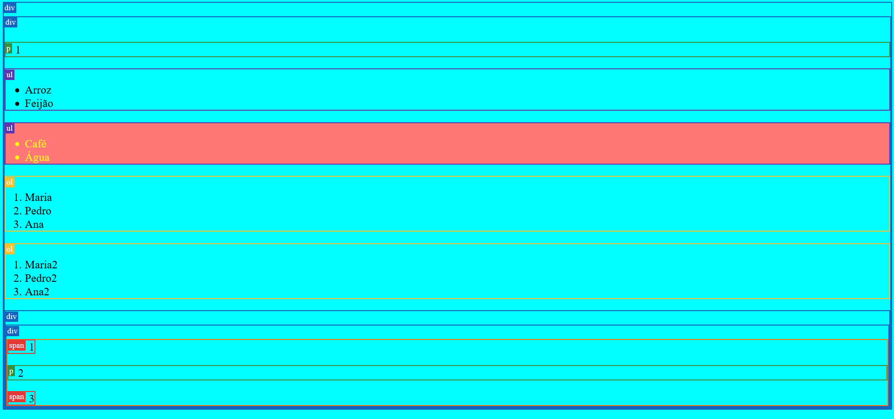

**nth-child()**

É uma pseudo-classe CSS que seleciona elementos com base em suas posições em um grupo de elementos irmãos.

Procura e seleciona um elemento span que seja filho número 3 de uma outra tag:

```CSS
span:nth-child(3) {
    color: #ff0;
    background-color: #f77;
}
```

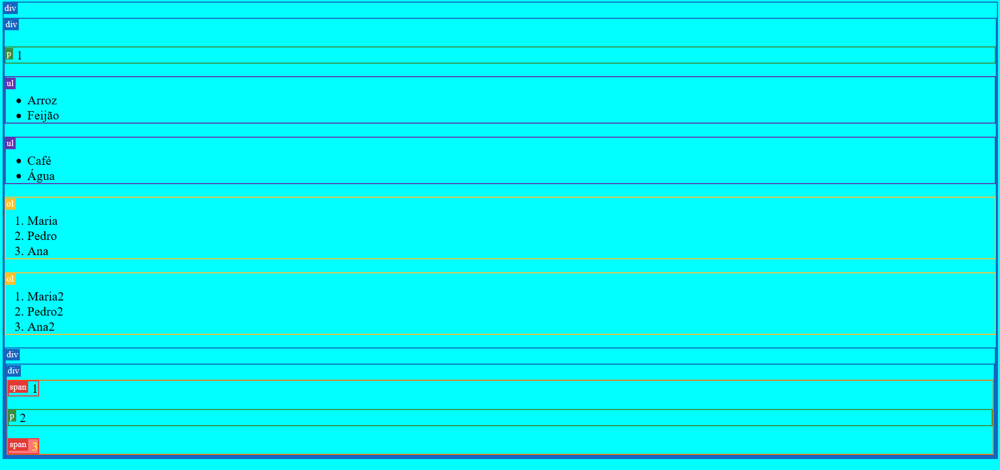

Seleciona os filhos ímpares do elemento section:

```CSS
section > :nth-child(odd) {
    color: #ff0;
    background-color: #f77;
}
```

Seleciona o segundo span dentro do elemento section:

```CSS
section > span:nth-of-type(2) {
    color: #ff0;
    background-color: #f77;
}
```

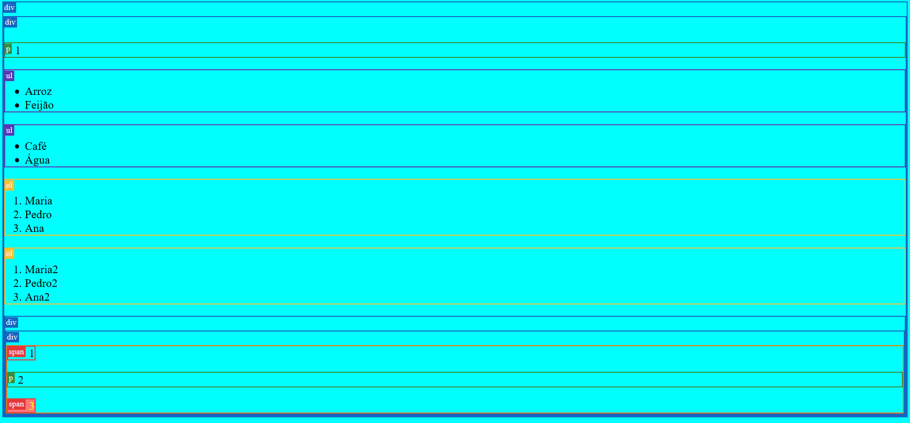

## Referências

-   https://developer.mozilla.org/pt-BR/docs/SWeb/CSS/Getting_Started/Seletores

-   https://developer.mozilla.org/pt-BR/docs/Web/CSS/:nth-child
