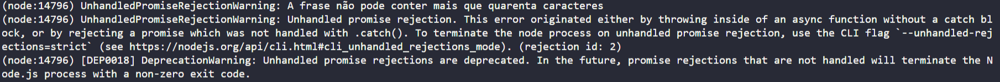

## Promises

Uma promise é um objeto usado para processamento assíncrono, rerpesenta uma eventual falha ou conclusão de uma operação assíncrona, é um valor que pode estar disponível agora, no futuro ou nunca.

Na prática, é uma função que é retornada por outra função:

```JavaScript
function falarDepoisDe() {
    return new Promise()
}
```

A promise recebe um executor como parâmetro, que é uma função que recebe duas outras duas funções: a resolve para resolver em caso de sucesso e a reject em caso de erro:

```JavaScript
function falarDepoisDe() {
    return new Promise((resolve, reject) => {

    })
}
```

A função abaixo simula uma operação assíncrona, após um determinado tempo, imprime uma frase com até 40 caracteres:

```JavaScript
function falarDepoisDe(tempo, frase) {
    return new Promise((resolve, reject) => {
        if (frase.length > 40) {
            reject('A frase não pode conter mais que quarenta caracteres')
        }
        setTimeout(function () {
            resolve(frase)
        }, tempo)
    })
}
```

**then**
Ele é chamado quando uma função é realizada ou rejeitada, depois invoca o método de tratamento associado ao estado(resolve ou reject).

O método then retorna uma promise, isso permite que haja um encadeamento de promises:

```JavaScript
falarDepoisDe(3000, 'Oi')
    .then((frase) => frase.concat('?!'))
    .then((novaFrase) => novaFrase.concat('?!'))
    .then((elemento) => console.log(elemento)) // Oi?!?!
```

**catch**
Se a frase possuir mais que 40 caracteres a função reject é chamada, ou seja, ocorreu um erro:


O catch pode ser utilizado para tratar o erro acima, exibindo-o de forma mais amigável:

```JavaScript
falarDepoisDe(
    3000,
    'A Cuca cutuca o caqui, o Cuco cutuca a Cuca, a Cuca cutuca o Saci'
)
    .then((frase) => frase.concat('?!'))
    .then((novaFrase) => novaFrase.concat('?!'))
    .then((elemento) => console.log(elemento))
    .catch((erro) => console.log(erro)) // A frase não pode conter mais que quarenta caracteres
```

### Referências:

-   https://developer.mozilla.org/pt-BR/docs/Web/JavaScript/Reference/Global_Objects/Promise
