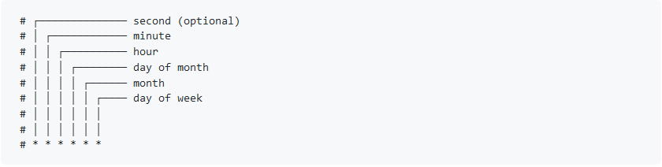
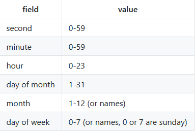
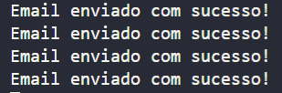
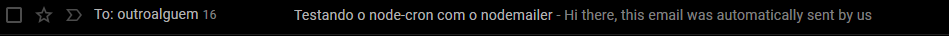

# Email Automático com Cron e Nodemailer

## Cron

É um módulo baseado no crontab, permite agendar tarefas e executá-las a cada x tempo.

**Argumentos**



**Valores permitidos**



## Nodemailer

É um módulo para aplicações Node.js, baseado no protocólo SMTP.

## Email Sender

**1º Importando os módulos e instânciando o express**

```JavaScript
const cron = require('node-cron');
const express = require('express');
let nodemailer = require('nodemailer');

app = express();
```

**2º Criando o transporter**

O transporter é um objeto que contém as configurações da mensagem que será enviada:

```JavaScript
let transporter = nodemailer.createTransport({
    service: 'gmail',
    auth: {
        user: 'seuemail@gmail.com',
        pass: 'suasenha',
    },
});
```

**3º Criando o temporizador**

Uma função que realiza o envio de email a cada 3 segundos:

```JavaScript
cron.schedule('*/3 * * * * *', function () {});
```

**4º Criando os dados da mensagem**

Um objeto que contem o conteúdo do email a ser enviado:

```JavaScript
 let mailOptions = {
        from: 'someone@gmail.com',
        to: 'othersomeone@gmail.com',
        subject: `Testing Cron with Nodemailer`,
        text: `Hi there, this email was automatically sent by us`,
    };
```

**5º Criando a função que enviará o email**

O primeiro parâmetro contém os dados da mensagem, o segundo é uma callback que possui um objeto de erro caso a mensagem falhe:

```JavaScript
   transporter.sendMail(mailOptions, function (error) {
        if (error) {
            throw error;
        } else {
            console.log('Email successfully sent!');
        }
    });
});
```

**6º Adicionando dentro do temporizador as opções de email e a função que envia-o**

Objeto com os dados da mensagem:

```JavaScript
cron.schedule('*/3 * * * * *', function () {
    let mailOptions = {
        from: 'someone@gmail.com',
        to: 'othersomeone@gmail.com',
        subject: `Testing Cron with Nodemailer`,
        text: `Hi there, this email was automatically sent by us`,
    };

    transporter.sendMail(mailOptions, function (error) {
        if (error) {
            throw error;
        } else {
            console.log('Email successfully sent!');
        }
    });
});
```

**7º Iniciando o servidor na porta informada**

```JavaScript
app.listen('3000');
```

**8º RUN!**




## Referências

-   https://github.com/node-cron/node-cron
-   https://nodemailer.com/usage/
