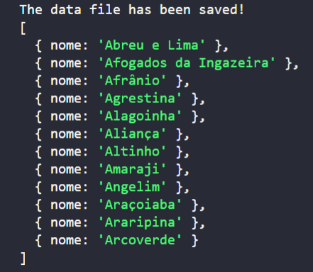

# File System

É um módulo do node que permite a manipulação de arquivos de forma síncrona ou assíncrona. Operações de forma síncrona de um arquivo muito grande podem travar o event loop do NodeJS, pois ele só irá receber a próxima requisição depois que a atual for concluída.

Dentre as diversas operações existentes:

**Escrita**

O writeFile recebe os seguintes parâmetros: caminho do arquivo, conteúdo a ser escrito, encode e uma callback onde seu primeiro parâmetro é um erro que poderá ser tratado caso a operação falhe.

```JavaScript
const fs = require('fs');
const path = 'json/PE-A.json';

// O primeiro parâmetro é um JSON de um estado com suas cidades, o segundo é a inicial da cidade, o retorno é um objeto com as cidades filtradas
function filterCities(content, param) {
    return content.cidades.filter((element) => element.nome[0] == param);
}


// Armazena o JSON em pernambuco, filtra as cidades que iniciam com a letra A e converte o retorno para string
const pernambuco = require('./json/pernambuco.json');
let citiesA = filterCities(pernambuco, 'A');
citiesA = JSON.stringify(citiesA);

// Local onde o arquivo será gerado, conteúdo a ser escrito, encode e callback
fs.writeFile(path, citiesA, 'utf8', (err) => {
    if (err) {
        throw err;
    }
    console.log('The data file has been saved!');
});
```

**Leitura**

O readFile recebe como parâmetro o caminho, encode e uma callback. O primeiro parâmetro da callback é um erro que poderá ser tratado caso a operação falhe, e o segundo são os dados.

Leitura dos dados escritos anteriormente:

```JavaScript
const path = __dirname + '/json/pernambuco.json';
fs.readFile(path, 'utf-8', function (err, data) {
    if (err) throw err;
    console.log(data);
});
```



## Referências

-   https://nodejs.org/docs/latest-v12.x/api/fs.html#fs_fs_readfile_path_options_callback

-   https://www.w3schools.com/nodejs/nodejs_filesystem.asp
