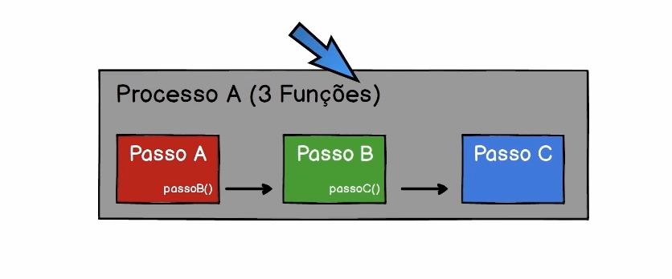
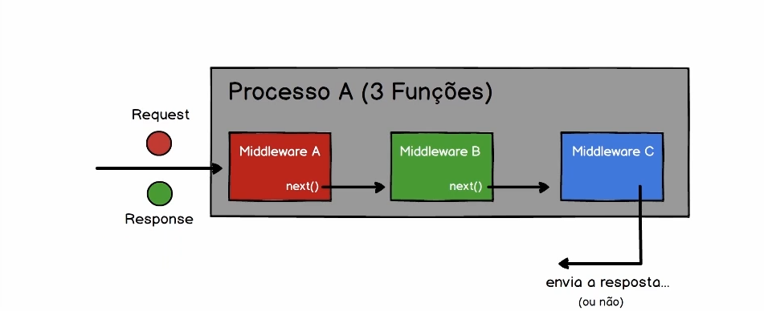

# Middleware

Baseado no padrão Chain of Responsibility e utilizado no framework express. É uma cadeia de passos que recebem uma função next() responsável por chamar o próximo passo. A chamada dos passos é opcional e a ordem de chamada não importa, pois eles são independentes.

**O problema**

Acoplamento/dependência entre os passos.


**A solução**

No padrão middleware os passos não estão mais acoplados, não se conhecem. O primeiro passo vai receber uma requisição e resposta(contexto) que é passado para uma sequência de passos.


**Implementação**

Os passos recebem um contexto e a função next como parâmetro:

```JavaScript
function passo1(contexto, next) {
    contexto.valor1 = 'Você';
    next();
}

function passo2(contexto, next) {
    contexto.valor2 = 'é';
    next();
}

function passo3(contexto, next) {
    contexto.valor3 = 'Incrível';
    next();
}
```

A função executar vai receber o contexto e um array de funções(passos) que devem ser executadas:

```JavaScript
function executar(contexto, ...middlewares) {
    function executaPasso(indice) {
        // Verifica se o array está setado e se o índice informado é um dos índices do array de middlewares
        middlewares &&
            indice < middlewares.length &&
            // Executa a função dentro do array de middlewares e chama de forma recursiva a executaPasso() incrementando o índice para o próximo passo ser chamado
            middlewares[indice](contexto, () => executaPasso(indice + 1));
    }
    executaPasso(0);
}
```

Invoca a função executora:

```JavaScript
const objeto = {};
executar(objeto, passo1, passo2, passo3);
console.log(objeto); // { valor1: 'Você', valor2: 'é', valor3: 'Incrível' }
```

A ordem dos passos não importa:

```JavaScript
executar(objeto, passo3, passo1, passo2);
console.log(objeto); // { valor3: 'Incrível', valor1: 'Você', valor2: 'é' }

```

## Referências

-   [Aula Padrão Middleware de Leonardo Leitão - Web Moderno 2020](https://www.udemy.com/course/curso-web/learn/lecture/9277254#overview)
